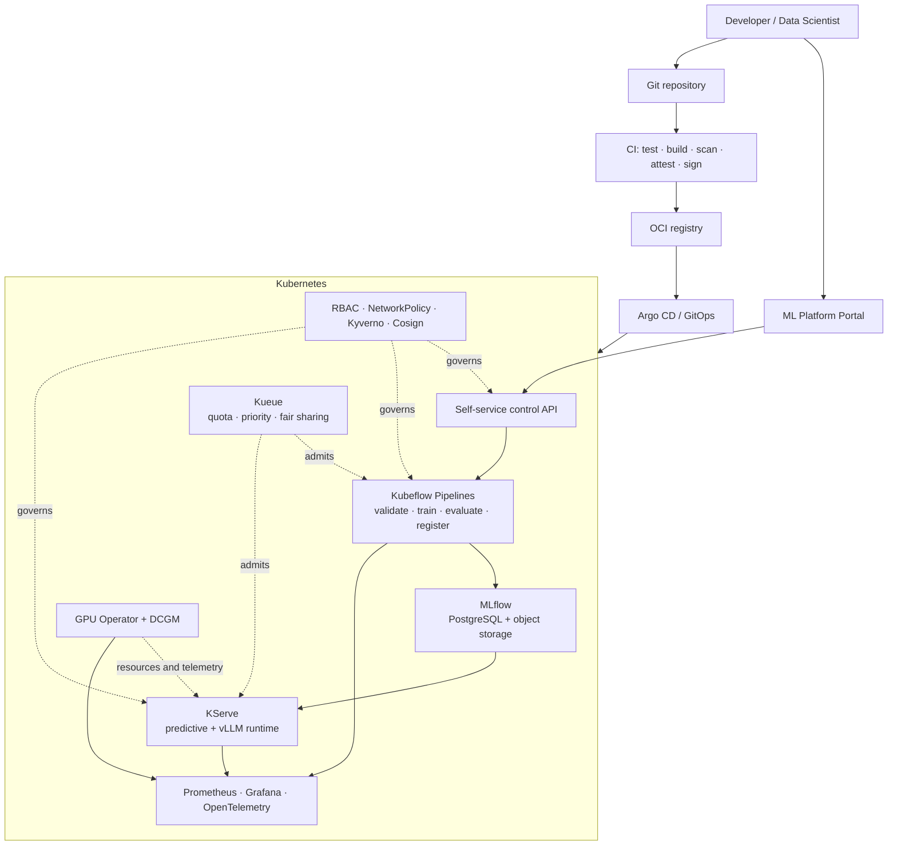
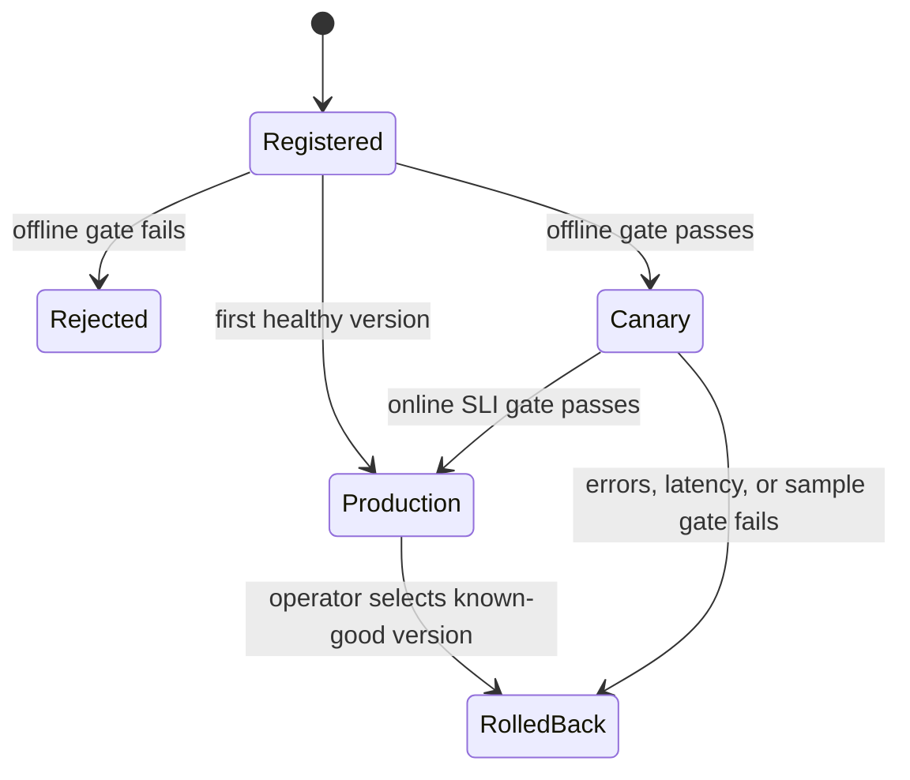

# ML Platform Blueprint

[](https://github.com/toby0622/ML-Platform-Blueprint/actions/workflows/ci.yml)
[](LICENSE)
[](pyproject.toml)

A production-style, multi-tenant ML platform reference implementation for
Kubernetes. It demonstrates the complete lifecycle of a predictive model and
provides an optional GPU/LLM serving path:

> 繁體中文讀者可直接從
> [ML Platform Blueprint 完整上手教學](docs/tutorial-zh-TW.md)開始，依序完成
> 純 Python、Portal、Docker Compose、Kubernetes、GPU 與 AWS 路徑。

```text
data validation -> train -> evaluate -> register -> quality gate
                -> canary -> promote or rollback -> observe
```

The model is deliberately simple. The engineering evidence is in
reproducibility, lineage, policy, deployment safety, tenancy, observability, and
operations.

> 繁體中文摘要：這是一個可在筆電直接跑通、也能延伸到 Kubernetes 與 GPU
> 環境的 AI Platform 旗艦專案。主線涵蓋訓練、評估、模型註冊、品質閘門、
> canary、rollback、audit、multi-tenancy、Kueue、公平配額、監控與 GitOps。
> GPU/vLLM 是選配層，不需要為了本專案先購買工作站。

## What is actually implemented

The repository has two deliberately connected layers.

| Layer | Purpose | Runtime |
|---|---|---|
| Portal | Unified command center for models, runs, deployments, inference, audit, and reviewed GPU evidence | Next/React, server-side BFF |
| Reference plane | Deterministic training, evaluation, immutable artifact registry, lineage, promotion policy, canary routing, rollback, audit, API, CLI, and metrics | Python, NumPy, SQLite |
| Kubernetes blueprint | KFP, MLflow, KServe, Kueue, GPU Operator/DCGM, Prometheus/Grafana/OTel, Kyverno, Argo CD, tenant isolation, and AWS IaC | Kubernetes and optional AWS/GPU |

The reference plane makes the lifecycle testable without a cloud account. The
Kubernetes layer maps those same contracts onto production-oriented components;
it is not a disconnected collection of YAML.

## Architecture



See [the detailed architecture](docs/architecture/architecture.md), the
[threat model](docs/architecture/threat-model.md), and the
[decision records](docs/adr/).

## Portal Dashboard

The primary local entry point is now the ML Platform Command Center rather than
an API endpoint. It provides Demo and Live modes, model/run discovery,
policy-gated deployment actions, predictive and GPU inference playgrounds,
observability drill-through, audit context, and reviewed RTX 4080 SUPER
evidence.

```powershell
Copy-Item .env.example .env
docker compose up --build --detach
docker compose exec platform-api ml-platform --tenant team-a --model churn-risk demo
```

Open [http://127.0.0.1:3001](http://127.0.0.1:3001), switch to **Live**, and
select `team-a`. See the [complete Portal guide](docs/portal.md) for the
role-based workflow, local frontend development, GPU chat, and the boundary
between public Demo data and local live state.

## Five-minute local lifecycle

Requirements: Python 3.11 or newer. No Docker, Kubernetes, notebook, or network
download is required after dependencies are installed.

```bash
python -m venv .venv
source .venv/bin/activate               # Windows: .venv\Scripts\Activate.ps1
python -m pip install -e .

ml-platform --state-dir .ml-platform demo
```

The demo executes two complete training runs, promotes the first version,
routes stable/canary traffic to the second version, evaluates online SLIs, and
finalizes the candidate. Inspect the durable evidence:

```bash
ml-platform --state-dir .ml-platform status
ml-platform --state-dir .ml-platform audit
```

Artifacts are stored under
`.ml-platform/artifacts/<tenant>/<model>/<version>/` with:

- `model.json` — portable, non-executable model artifact;
- `metadata.json` — code, data, parameters, metrics, and pipeline lineage;
- `MODEL_CARD.md` — intended use, evaluation, lineage, and limitations.

### HTTP API

```bash
ml-platform --state-dir .ml-platform serve --port 8080
```

Open [http://localhost:8080/docs](http://localhost:8080/docs), or train through
the API:

```bash
curl -X POST http://localhost:8080/v1/tenants/team-a/models/churn-classifier/runs \
  -H 'Content-Type: application/json' \
  -H 'X-Tenant-Id: team-a' \
  -d '{}'
```

Promotion is a separate, audited action. A candidate that misses accuracy, F1,
ROC-AUC, Brier-score, or sample-size policy receives `422
quality_gate_rejected` and cannot receive traffic.

## Full local stack with MLflow

Requirements: Docker with Compose.

```bash
cp .env.example .env
# Change all local passwords in .env.
docker compose up --build -d
docker compose ps
```

| Endpoint | URL |
|---|---|
| ML Platform Portal | http://localhost:3001 |
| Platform API | http://localhost:8080/docs |
| MLflow | http://localhost:5000 |
| MinIO console | http://localhost:9001 |
| Prometheus | http://localhost:9090 |
| Grafana | http://localhost:3000 |

Compose uses PostgreSQL for MLflow metadata and MinIO for artifacts. The
platform mirrors every local tracking event to MLflow when
`MLFLOW_TRACKING_URI` is configured. Instrumented API spans flow through the
OpenTelemetry Collector gateway to MLflow; health, readiness, and metrics
probes are excluded.

## Local RTX 4080 SUPER inference

The repository includes a separate, pinned vLLM profile for one NVIDIA GPU.
The tested inventory target is an RTX 4080 SUPER with 16 GB VRAM. On Windows,
vLLM runs as a Linux container through the Docker Desktop WSL 2 engine; it is
not installed as a native Windows package.

```powershell
python scripts/gpu_preflight.py
Copy-Item .env.example .env
docker compose --file compose.gpu.yaml up --detach

python -m benchmarks.inference.run_local_gpu --scenario baseline
python -m benchmarks.inference.run_local_gpu --scenario prefix-cache
python -m benchmarks.inference.run_local_gpu --scenario constrained-batch
```

The scenario runner recreates the vLLM service with matching engine arguments,
waits for health, captures TTFT/ITL/token throughput, and samples GPU memory,
utilization, temperature, and power through `nvidia-smi`. The default public
Apache-2.0 1.5B model and 75% VRAM fraction leave headroom for the Windows
display workload. Docker GPU passthrough, health/models/chat, and all three
three-run scenarios are runtime-validated. The 900-request reviewed result is
[local-rtx4080-super-vllm-summary.json](docs/benchmarks/evidence/local-rtx4080-super-vllm-summary.json).

See the [complete local GPU guide](docs/local-gpu.md) for WSL/Docker setup,
configuration, quantization experiments, evidence rules, and the single-GPU
KServe overlay.

## Kubernetes lab

Requirements: Docker, kind, kubectl, and Helm.

```powershell
./scripts/bootstrap-kind.ps1
# Add -WithKfp only on a machine with enough CPU and memory.
```

```bash
./scripts/bootstrap-kind.sh
# WITH_KFP=true ./scripts/bootstrap-kind.sh
```

The bootstrap installs pinned prerequisites, then applies Argo CD, tenant
boundaries, Kueue quotas, and policy. It does **not** install the GPU layer on a
CPU-only kind cluster. See [the cluster guide](infra/cluster/README.md).

Production AWS infrastructure lives under
[`infra/terraform/aws`](infra/terraform/aws/README.md). GPU and RDS are disabled
by default to prevent accidental spend.

## Safe promotion contract



Offline policy:

- accuracy ≥ 0.72;
- F1 ≥ 0.68;
- ROC-AUC ≥ 0.78;
- Brier score ≤ 0.20;
- at least 100 evaluation samples.

Online policy:

- canary error-rate increase ≤ 2 percentage points;
- canary p95 latency ≤ 1.25 × stable p95;
- at least 100 canary samples.

Both decisions record the actor, reason, observed values, thresholds, and
result. A failed online gate atomically removes canary traffic.

## Repository map

```text
src/ml_platform_blueprint/    runnable control and serving plane
pipelines/                    typed Kubeflow Pipeline
platform/                     Helm, Argo CD, Kueue, tenancy, policy, GPU
portal/                       Portal Dashboard, BFF routes, and container
serving/                      KServe predictive and vLLM manifests
infra/                        kind and AWS Terraform
observability/                Prometheus, Grafana, OpenTelemetry
benchmarks/                   load, vLLM, capacity, and cost tools
tests/                        unit, integration, and API/KServe e2e tests
docs/                         architecture, ADRs, articles, evidence
runbooks/                     incident response procedures
```

## Acceptance evidence

| Requirement | Evidence |
|---|---|
| Rebuildable | Dockerfiles, Compose, kind bootstrap, Helm, Terraform, CI |
| Reproducible | seeded generator, content hash, parameters, code revision, deterministic tests |
| Traceable | run/version tables, MLflow adapter, metadata, model card, audit API |
| Extensible | artifact contract, component CLI, typed KFP pipeline, custom KServe runtime |
| Deployable | explicit offline gate and immutable version transition |
| Rollbackable | deterministic routing, manual rollback, automatic SLI rollback |
| Observable | service/model/pipeline/GPU metrics, alerts, dashboard, OTel |
| Isolated | namespace RBAC, quota, LimitRange, NetworkPolicy, Kyverno, Kueue |
| Benchmarkable | versioned load/vLLM configs and cost assumptions |
| Explainable | architecture, eight ADRs, runbooks, synthetic postmortem |

The detailed, test-linked matrix is in
[docs/acceptance-evidence.md](docs/acceptance-evidence.md).

## Quality checks

```bash
python -m pip install -e '.[dev]'
ruff check .
ruff format --check .
mypy
python scripts/validate_repository.py
pytest --cov
```

CI also compiles the KFP pipeline, renders Helm/Kustomize resources, builds the
container, and scans it. Tagged releases produce SBOM/provenance and use
keyless Cosign signing. The production Kyverno overlay verifies those
signatures.

## Honest boundaries

- Synthetic data proves platform behavior, not business model quality.
- The local registry uses SQLite and one replica. MLflow production metadata
  uses PostgreSQL; horizontally scaling the custom control plane requires the
  planned PostgreSQL registry adapter.
- Kubernetes and cloud profiles must be validated in their target environment.
  The local RTX result covers one WSL 2 workstation and one 1.5B model; it does
  not prove native-Linux, KServe, autoscaling, multi-GPU, quality, or cost.
- Secrets are intentionally absent. Use External Secrets, a cloud secret
  manager, or equivalent workload identity.
- KServe, Kueue, KFP, MLflow, and GPU Operator upgrades require compatibility
  testing; see [known limitations](docs/known-limitations.md).

## Documentation

- [繁體中文完整上手教學](docs/tutorial-zh-TW.md)
- [Architecture](docs/architecture/architecture.md)
- [Acceptance evidence](docs/acceptance-evidence.md)
- [ADRs](docs/adr/)
- [Runbooks](runbooks/)
- [Measured CPU and local RTX GPU benchmarks](docs/benchmarks/report.md)
- [Local RTX 4080 SUPER profile](docs/local-gpu.md)
- [Synthetic postmortem](docs/postmortems/2026-07-28-canary-latency-regression.md)
- [8–12 minute demo script](docs/demo-script.md)
- [Technical articles](docs/articles/)
- [Known limitations](docs/known-limitations.md) and [roadmap](docs/roadmap.md)
- [Target role and skill-gap matrix](docs/target-role.md)

## License

Apache License 2.0. See [LICENSE](LICENSE).
