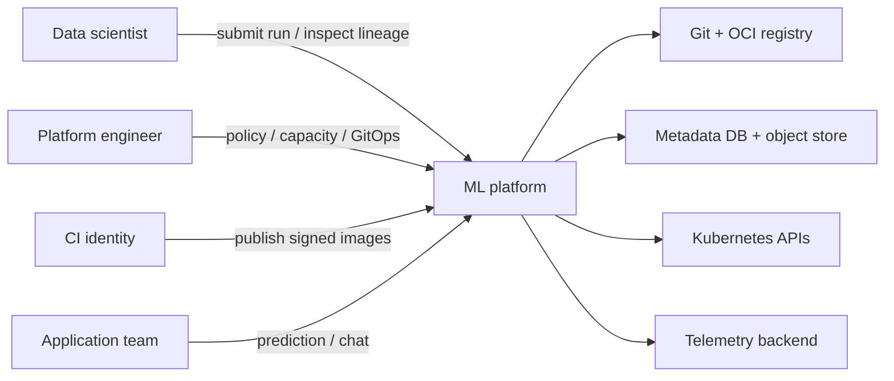
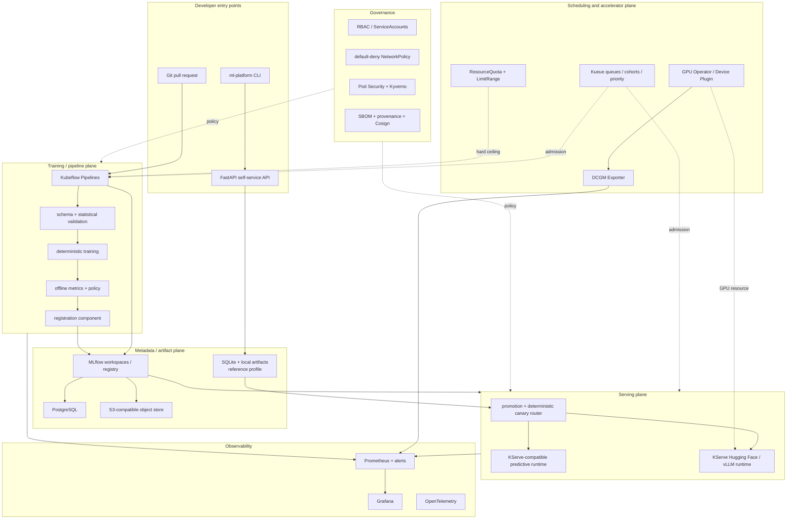
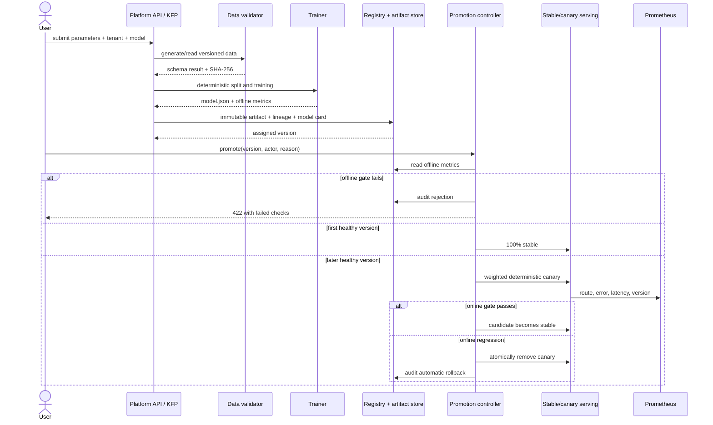

# Architecture

## Goals and quality attributes

ML Platform Blueprint is an internal platform product for data scientists and
ML engineers. It optimizes for:

1. reproducible and traceable model changes;
2. safe, observable delivery rather than raw deployment speed;
3. tenant self-service within explicit resource and security boundaries;
4. a laptop-sized development loop with a credible Kubernetes production path;
5. replaceable components connected by stable artifact and API contracts.

It does not optimize the classifier itself, implement a general-purpose feature
store, or pretend a home lab is a globally available production service.

## System context



Trust boundaries are the CI identity, cluster API, tenant namespaces, metadata
plane, artifact store, and external inference clients.

## Container and plane view



## Model lifecycle sequence



## Artifact and lineage contract

The reference artifact is canonical JSON rather than pickle. Loading it does
not execute code. Its SHA-256 is verified before inference.

```text
tenant/model/version/
├── model.json
├── metadata.json
└── MODEL_CARD.md
```

`metadata.json` connects:

```text
model version
  -> pipeline run ID
  -> code revision
  -> dataset SHA-256
  -> parameters
  -> offline metrics
  -> artifact SHA-256
```

The KFP path carries typed Dataset, Model, Metrics, and registration artifacts.
The API mirror records run-scoped parameters, metrics, and tags in MLflow. The
KFP registration component additionally logs the model artifact and creates the
tenant-qualified registered model version (`<tenant>--<model>`).

## Tenancy

Tenant identity appears in the API path, registry key, Kubernetes namespace,
Kueue queue, metrics labels, and audit event. Defense in depth:

| Boundary | Mechanism |
|---|---|
| API | allowlist and optional `X-Tenant-Id` consistency check |
| Kubernetes API | namespace Role/RoleBinding, dedicated ServiceAccounts |
| Compute | ResourceQuota, LimitRange, Kueue nominal/borrow limits |
| Network | default deny; explicit DNS, platform, gateway, and monitoring flows |
| Admission | Pod Security restricted plus Kyverno workload rules |
| Supply chain | lab tags for iteration; production digest policy plus keyless signature verification |
| Object storage | EKS Pod Identity; pipeline read/write and serving read-only within `tenants/<tenant>/` |
| Metadata | tenant tags and naming for logical separation; separate MLflow deployments and artifact IAM for hard isolation |

Kueue provides admission control and fair borrowing. ResourceQuota remains the
hard namespace ceiling even if queue policy is misconfigured.

## Availability and consistency

- The local registry uses SQLite transactions, WAL, immutable files, and atomic
  file replacement. It is a single-replica reference profile.
- Deployment state, aliases, stages, history, and audit are changed in one
  database transaction.
- Request routing hashes a request ID into 100 buckets. Retries with the same ID
  reach the same revision, simplifying canary comparisons.
- KServe owns Kubernetes revision readiness and traffic shifting in the cluster
  profile.
- MLflow production metadata uses PostgreSQL; artifacts use versioned object
  storage.

## Environment profiles

| Profile | Purpose | Metadata/artifacts | Compute |
|---|---|---|---|
| Python | fastest deterministic lifecycle tests | SQLite/filesystem | local process |
| Compose | integrated metadata and telemetry | MLflow + PostgreSQL + MinIO | Docker |
| RTX workstation | vLLM scenario and GPU telemetry evidence | Hugging Face cache + hashed local results | one container-visible, desktop-shared RTX 4080 SUPER through WSL 2 Compose |
| kind | tenancy, policy, queue, GitOps, KServe control plane | lab PVC or external | CPU Kubernetes |
| AWS | production design | RDS + KMS/S3 | EKS CPU and optional A10G |
| GPU lab | inference evidence | chosen object store | real NVIDIA node |

The RTX workstation is a direct serving data-plane profile, not a substitute
for the Kubernetes GPU control plane. It validates CUDA container access,
vLLM behavior, OpenAI-compatible traffic, and host-visible GPU telemetry.
GPU Operator, DCGM, Kueue admission, KServe reconciliation, autoscaling, and
node-failure behavior remain native-Linux cluster validations.

## Failure domains

| Failure | Expected behavior |
|---|---|
| Bad offline model | promotion is rejected; no traffic changes |
| Bad canary | online gate clears canary and retains stable |
| Artifact tampering | SHA mismatch fails closed before model load |
| MLflow unavailable | new registration is blocked; existing serving remains independent |
| Object store unavailable | new pods may fail readiness; existing loaded models remain available |
| GPU unavailable | workload stays Pending; queue and DCGM alerts identify resource vs device failure |
| Tenant burst | Kueue queues work; ResourceQuota prevents unbounded allocation |
| GitOps drift | Argo CD detects and self-heals first-party resources |

Operational details are in [the runbooks](../../runbooks/).
