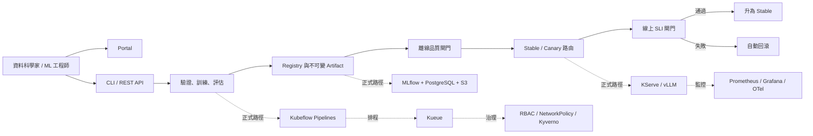

# ML Platform Blueprint 完整上手教學

這份教學把整個專案串成一條可以實際操作的學習路徑。你不需要先懂
Kubernetes、MLflow 或 GPU；先用純 Python 跑完模型生命週期，再依需求進入
Portal、Docker Compose、Kubeflow Pipelines、KServe、GPU 與 AWS。

專案的重點不是訓練出最強的分類模型，而是示範一個模型如何被：

```text
驗證資料 → 訓練 → 評估 → 登錄 → 品質閘門
         → Canary → 正式上線或回滾 → 監控與稽核
```

快速導覽：

- [純 Python 十分鐘快速體驗](#4-十分鐘快速體驗只用-python)
- [手動走一次完整生命週期](#5-手動走一次生命週期)
- [REST API](#7-啟動-rest-api)
- [Docker Compose 與 Portal](#10-用-docker-compose-啟動完整本機平台)
- [MLflow、KFP、KServe 與 Kubernetes](#12-mlflow-與-kubeflow-pipelines)
- [本機 GPU 與 Benchmark](#16-本機-nvidia-gpu-與-vllm)
- [AWS 正式環境藍圖](#18-aws-terraform-正式環境藍圖)
- [監控、Runbook 與疑難排解](#19-可觀測性)

## 1. 先選擇你的路線

| 你的目標 | 建議閱讀順序 | 最少需要 |
|---|---|---|
| 先看懂專案 | 第 2～5 章 | Python 3.11+ |
| 開發 API 或模型流程 | 第 4～9 章 | Python 3.11+ |
| 使用圖形化 Portal | 第 10～11 章 | Docker，或 Node.js 22.13+ |
| 學習 MLOps / Kubernetes | 第 12～15 章 | Docker、kind、kubectl、Helm |
| 跑本機 LLM / GPU | 第 16～17 章 | NVIDIA GPU、WSL 2、Docker Desktop |
| 規劃 AWS 正式環境 | 第 18 章 | Terraform 與 AWS 權限 |
| 維運、監控與事故處理 | 第 19～20 章 | 已啟動的 Compose 或 Kubernetes 環境 |

第一次接觸此專案時，建議至少完成第 4 章的快速體驗。那條路徑不需要
Docker、Kubernetes、雲端帳號或 GPU。

## 2. 這個專案解決什麼問題

一個能訓練模型的 Python 腳本，距離可維運的 ML 平台還缺少許多能力：

- 相同資料與參數能否重現結果；
- 模型、資料、程式版本與評估指標能否互相追溯；
- 不合格的模型能否被阻擋；
- 新版本能否先接收少量流量，異常時自動回滾；
- 不同團隊是否有身分、網路、資源與儲存邊界；
- 系統是否有指標、追蹤、告警、稽核與事故手冊；
- 映像、部署設定與效能數據是否有可驗證的證據。

本專案用兩個互相對應的層次回答這些問題：

| 層次 | 用途 | 主要技術 |
|---|---|---|
| 可執行參考平面 | 在一台電腦完整驗證訓練、登錄、升版、推論與回滾 | Python、NumPy、FastAPI、SQLite |
| Kubernetes 平台藍圖 | 把相同契約映射到正式平台元件 | KFP、MLflow、KServe、Kueue、Kyverno、Argo CD |
| 產品入口 | 讓使用者查看模型、執行紀錄、部署、推論與稽核 | React、Next 相容介面、BFF |
| 選用 GPU 路徑 | 執行 OpenAI 相容的本機 LLM 推論與可重現 benchmark | vLLM、NVIDIA GPU、Docker Compose |

### 2.1 誠實的邊界

這是一份 production-style 參考實作，不是可直接承載真實敏感資料的完整 SaaS：

- 內建資料是合成的 churn 二元分類資料，只能證明平台機制；
- 本機 registry 是單副本 SQLite，不適合水平擴充；
- API 的 tenant header 是示範契約，不是正式身分驗證；
- Kubernetes、GPU 與 AWS 設定仍須在目標環境做 runtime 驗證；
- 專案沒有 feature store、OIDC gateway 或 External Secrets；
- benchmark 只能代表記錄中所列的硬體、模型、設定與工作負載。

完整限制請閱讀[已知限制](known-limitations.md)與[威脅模型](architecture/threat-model.md)。

### 2.2 先分清楚三種證據

| 狀態 | 本專案中的例子 | 可以如何描述 |
|---|---|---|
| Runtime verified | 純 Python lifecycle、CLI/API/model-server tests、reviewed 本機 RTX evidence | 在記錄的環境與條件下已執行 |
| Static verified | KFP compile、Helm/Kustomize render、Terraform validate、CI image build | 契約與語法通過，不等於 cluster runtime |
| Target-environment pending | KFP→KServe 自動交付、kind canary networking、AWS、native-Linux GPU、HA/DR | 必須在指定環境另做驗證 |

往後看到 manifest、Terraform 或歷史 benchmark 時，都先判斷它屬於哪一層。
這能避免把「可 render」誤寫成「已上線」，也避免把單機數據當成正式容量。

## 3. 一張圖看懂系統



### 3.1 一次模型升版會留下什麼

每次訓練會產生：

1. 一個 run ID；
2. 程式版本、資料 SHA-256 與訓練參數；
3. accuracy、F1、ROC-AUC、Brier score 等離線指標；
4. 一個不可變的模型版本；
5. `model.json`、`metadata.json` 與 `MODEL_CARD.md`；
6. 本機 tracking snapshot，選配同步到 MLflow；
7. 後續 promotion、canary、finalize 或 rollback 的 audit event。

## 4. 十分鐘快速體驗：只用 Python

### 4.1 必要條件

- Python 3.11 或更新版本；
- 可在第一次安裝時下載 Python 相依套件；
- Windows PowerShell、macOS 或 Linux shell 皆可。

確認版本：

```bash
python --version
```

### 4.2 建立虛擬環境

Windows PowerShell：

```powershell
python -m venv .venv
.\.venv\Scripts\Activate.ps1
python -m pip install --upgrade pip
python -m pip install -e .
```

macOS / Linux：

```bash
python -m venv .venv
source .venv/bin/activate
python -m pip install --upgrade pip
python -m pip install -e .
```

`-e` 是 editable install；修改 `src/` 後不需要重新打包。

### 4.3 跑完整生命週期

```bash
ml-platform \
  --state-dir .ml-platform/tutorial \
  --tenant team-a \
  --model churn-classifier \
  demo
```

PowerShell 也可以把命令寫在同一行：

```powershell
ml-platform --state-dir .ml-platform/tutorial --tenant team-a --model churn-classifier demo
```

這個 demo 會自動：

1. 訓練並登錄 baseline version 1；
2. 讓 version 1 通過離線品質閘門並成為 stable；
3. 用不同超參數訓練 candidate version 2；
4. 以 20% 權重啟動 canary；
5. 用固定 request ID 示範穩定路由；
6. 送入健康的線上 SLI；
7. 將 version 2 升為 stable；
8. 留下完整稽核紀錄。

`demo` 是為乾淨的 state directory 設計。同一路徑已經有 deployment 時，不要
重複執行；請換一個 `--state-dir`，或改用後續章節的單步命令。

檢查最後狀態：

```bash
ml-platform --state-dir .ml-platform/tutorial --tenant team-a --model churn-classifier status
ml-platform --state-dir .ml-platform/tutorial --tenant team-a --model churn-classifier audit
```

成功時應看到兩個版本、`stable_version` 為 `2`，且沒有作用中的
`canary_version`。

> CLI 的全域參數必須放在子命令前面。正確寫法是
> `ml-platform --tenant team-a train`，不是
> `ml-platform train --tenant team-a`。

### 4.4 查看真正的證據檔案

```text
.ml-platform/tutorial/
├── registry.sqlite3
├── tracking/
│   └── <run-id>.json
└── artifacts/
    └── team-a/
        └── churn-classifier/
            ├── 1/
            │   ├── model.json
            │   ├── metadata.json
            │   └── MODEL_CARD.md
            └── 2/
                ├── model.json
                ├── metadata.json
                └── MODEL_CARD.md
```

- `model.json` 是不會在載入時執行任意程式的 JSON 模型；
- `metadata.json` 串起 run、版本、資料 hash、參數、指標與 artifact hash；
- `MODEL_CARD.md` 說明用途、評估、限制與 lineage；
- `registry.sqlite3` 保存 run、版本、alias、部署狀態與 audit；
- `tracking/*.json` 是即使 MLflow 不可用也會保留的本機追蹤證據。

不要手動修改已登錄的 `model.json`。載入時會驗證 SHA-256，遭竄改的
artifact 會 fail closed。

## 5. 手動走一次生命週期

自動 demo 適合第一次體驗；手動操作能看清每一個決策點。
以下步驟假設 `.ml-platform/manual` 是新路徑；若已經用過，請換一個
state directory，避免版本編號與部署狀態和範例不同。

以下命令都使用同一組前綴：

```text
ml-platform --state-dir .ml-platform/manual --tenant team-a --model churn-classifier
```

### 5.1 初始化與訓練 baseline

```bash
ml-platform --state-dir .ml-platform/manual --tenant team-a --model churn-classifier init
ml-platform --state-dir .ml-platform/manual --tenant team-a --model churn-classifier train
```

`init` 是顯式初始化動作；其他命令也會在需要時自動建立 registry。

預設訓練參數：

| 參數 | 預設值 | 用途 |
|---|---:|---|
| `samples` | 800 | 合成資料筆數 |
| `data_seed` | 42 | 資料生成 seed |
| `split_seed` | 42 | 分層切分 seed |
| `test_fraction` | 0.2 | 評估資料比例 |
| `learning_rate` | 0.12 | batch gradient descent 學習率 |
| `epochs` | 700 | 訓練回合 |
| `l2` | 0.01 | L2 正則化 |
| `decision_threshold` | 0.5 | 二元分類門檻 |

內建六個特徵：

```text
tenure_months
monthly_spend
support_tickets
usage_score
payment_failures
contract_months
```

相同 samples、seed 與參數會產生相同資料 checksum 和模型內容。

### 5.2 讓第一版正式上線

```bash
ml-platform --state-dir .ml-platform/manual --tenant team-a --model churn-classifier promote \
  --version 1 \
  --actor tutorial-user \
  --reason "baseline passed offline review"
```

第一個通過品質閘門的版本會直接成為 stable，不會建立沒有比較基準的 canary。

離線品質閘門必須同時滿足：

| 指標 | 條件 |
|---|---:|
| Accuracy | `>= 0.72` |
| F1 | `>= 0.68` |
| ROC-AUC | `>= 0.78` |
| Brier score | `<= 0.20` |
| Evaluation samples | `>= 100` |

### 5.3 執行推論

使用內建範例：

```bash
ml-platform --state-dir .ml-platform/manual --tenant team-a --model churn-classifier predict \
  --request-id tutorial-request-001
```

自訂單筆輸入：

```bash
ml-platform --state-dir .ml-platform/manual --tenant team-a --model churn-classifier predict \
  --request-id customer-42 \
  --instance '{"tenure_months":12,"monthly_spend":90,"support_tickets":2,"usage_score":55,"payment_failures":1,"contract_months":1}'
```

輸出包含 label、probability、實際版本與 `stable` / `canary` route。

### 5.4 建立 version 2 並啟動 Canary

```bash
ml-platform --state-dir .ml-platform/manual --tenant team-a --model churn-classifier train \
  --epochs 900 \
  --l2 0.005

ml-platform --state-dir .ml-platform/manual --tenant team-a --model churn-classifier promote \
  --version 2 \
  --canary-weight 20 \
  --actor tutorial-user \
  --reason "candidate passed offline review"
```

`canary-weight` 可設為 1～50。路由不是每次隨機抽籤，而是對 request ID
做 deterministic hash；同一個 ID 在部署狀態不變時會落到同一版本，適合重試。
若呼叫端不提供 request ID，服務會產生一個 UUID。

### 5.5 線上 SLI 健康：完成升版

```bash
ml-platform --state-dir .ml-platform/manual --tenant team-a --model churn-classifier finalize \
  --stable-error-rate 0.010 \
  --canary-error-rate 0.012 \
  --stable-p95-ms 35 \
  --canary-p95-ms 37 \
  --sample-size 500 \
  --actor tutorial-user \
  --reason "candidate passed online SLI review"
```

線上閘門要求：

- canary error rate 最多比 stable 高 2 個百分點；
- canary p95 latency 最多是 stable 的 1.25 倍；
- canary 至少有 100 筆樣本。

全部通過後，version 2 會原子性地成為 stable，canary 流量歸零。

### 5.6 線上 SLI 異常：自動回滾

如果 version 2 正在 canary，可用以下數據練習失敗路徑：

```bash
ml-platform --state-dir .ml-platform/manual --tenant team-a --model churn-classifier finalize \
  --stable-error-rate 0.01 \
  --canary-error-rate 0.08 \
  --stable-p95-ms 40 \
  --canary-p95-ms 90 \
  --sample-size 200 \
  --actor tutorial-user \
  --reason "exercise automatic rollback"
```

命令會回傳 exit code `2` 與 `quality_gate_rejected`，但回滾已在同一個交易中
完成。接著用 `status` 和 `audit` 確認 canary 已被移除。

### 5.7 手動回滾

捨棄目前作用中的 canary：

```bash
ml-platform --state-dir .ml-platform/manual --tenant team-a --model churn-classifier rollback \
  --actor tutorial-user \
  --reason "stop current canary"
```

把 stable 明確切回已知良好的 version 1：

```bash
ml-platform --state-dir .ml-platform/manual --tenant team-a --model churn-classifier rollback \
  --target-version 1 \
  --actor tutorial-user \
  --reason "restore known-good version"
```

## 6. CLI 命令速查

先看任何命令的即時說明：

```bash
ml-platform --help
ml-platform train --help
```

| 子命令 | 功能 |
|---|---|
| `init` | 初始化本機 registry |
| `train` | 生成/驗證資料、訓練、評估並登錄 |
| `promote` | 執行離線 gate，建立 stable 或 canary |
| `predict` | 經 stable/canary router 做參考推論 |
| `finalize` | 評估線上 SLI，升版或自動回滾 |
| `rollback` | 捨棄 canary 或切回指定 stable version |
| `status` | 列出版本與目前部署狀態 |
| `audit` | 列出治理與部署事件 |
| `demo` | 自動跑完整健康生命週期 |
| `serve` | 啟動 FastAPI |

CLI 正常完成回傳 `0`，一般輸入/狀態錯誤回傳 `1`，品質 gate 拒絕回傳 `2`。
所有輸出都是 JSON，方便接到自動化腳本。

## 7. 啟動 REST API

```bash
ml-platform --state-dir .ml-platform/api serve --host 127.0.0.1 --port 8080
```

開啟：

- Swagger UI：<http://127.0.0.1:8080/docs>
- OpenAPI：<http://127.0.0.1:8080/openapi.json>
- Liveness：<http://127.0.0.1:8080/healthz>
- Readiness：<http://127.0.0.1:8080/readyz>
- Prometheus metrics：<http://127.0.0.1:8080/metrics>

第一次使用 API，直接在 Swagger UI 點選端點、按 **Try it out** 最容易。

### 7.1 PowerShell 範例

```powershell
$base = "http://127.0.0.1:8080"
$headers = @{ "X-Tenant-Id" = "team-a" }

$run = Invoke-RestMethod `
  -Uri "$base/v1/tenants/team-a/models/churn-classifier/runs" `
  -Method Post `
  -Headers $headers `
  -ContentType "application/json" `
  -Body "{}"

$version = $run.model_version.version

$promotion = @{
  canary_weight = 10
  actor = "tutorial-user"
  reason = "offline review passed"
} | ConvertTo-Json

Invoke-RestMethod `
  -Uri "$base/v1/tenants/team-a/models/churn-classifier/versions/$version/promotion" `
  -Method Post `
  -Headers $headers `
  -ContentType "application/json" `
  -Body $promotion
```

推論：

```powershell
$prediction = @{
  request_id = "api-tutorial-001"
  instances = @(
    @{
      tenure_months = 12
      monthly_spend = 90
      support_tickets = 2
      usage_score = 55
      payment_failures = 1
      contract_months = 1
    }
  )
} | ConvertTo-Json -Depth 4

Invoke-RestMethod `
  -Uri "$base/v1/tenants/team-a/models/churn-classifier/predict" `
  -Method Post `
  -Headers $headers `
  -ContentType "application/json" `
  -Body $prediction
```

### 7.2 curl 範例

```bash
curl -fsS -X POST \
  http://127.0.0.1:8080/v1/tenants/team-a/models/churn-classifier/runs \
  -H 'Content-Type: application/json' \
  -H 'X-Tenant-Id: team-a' \
  -d '{}'
```

在 Windows PowerShell 若 `curl` 被當成 alias，請改用 `curl.exe`。

### 7.3 API 端點總表

| 方法與路徑 | 用途 |
|---|---|
| `GET /` | 服務版本、環境與連結 |
| `GET /healthz` | Liveness |
| `GET /readyz` | Registry readiness |
| `GET /metrics` | Prometheus 指標 |
| `GET /v1/tenants` | 可用 tenant |
| `GET /v1/tenants/{tenant}/overview` | Portal overview |
| `GET /v1/tenants/{tenant}/models` | 模型清單 |
| `GET /v1/tenants/{tenant}/runs` | Run 清單，可用 model 與 limit 篩選 |
| `GET /v1/tenants/{tenant}/runs/{run_id}` | Tenant 內的單一 run |
| `POST /v1/tenants/{tenant}/models/{model}/runs` | 訓練與登錄 |
| `GET /v1/runs/{run_id}` | 參考用的 run 查詢 |
| `GET /v1/tenants/{tenant}/models/{model}/versions` | 版本清單 |
| `GET /v1/tenants/{tenant}/models/{model}/versions/{version}` | 版本與 lineage |
| `POST .../versions/{version}/promotion` | 離線 gate 與升版 |
| `GET .../deployment` | 目前 stable/canary |
| `GET .../deployment/history` | 部署歷史 |
| `POST .../deployment/finalize` | 線上 gate |
| `POST .../deployment/rollback` | 手動回滾 |
| `POST .../predict` | 批次參考推論，最多 1,000 筆 |
| `GET .../audit` | 稽核事件 |

API request model 禁止多餘欄位。路徑中的 tenant 與選填的 `X-Tenant-Id`
不一致時會回傳 `403`。這只是防止示範環境中的 tenant 混用；正式環境必須由
OIDC-aware gateway 從已驗證的 claims 推導 tenant 與 actor，不能信任呼叫端自填的
header。

## 8. 核心程式碼導覽

| 檔案 | 責任 |
|---|---|
| `src/ml_platform_blueprint/config.py` | 環境變數與 runtime settings |
| `data.py` | 可重現合成資料、schema 與統計驗證、分層切分 |
| `model.py` | NumPy logistic regression 與安全 JSON artifact |
| `metrics.py` | Accuracy、precision、recall、F1、ROC-AUC、Brier |
| `registry.py` | SQLite schema、不可變 artifact、alias、audit、部署交易 |
| `promotion.py` | 離線與線上 gate、promotion、finalize、rollback |
| `service.py` | CLI/API 共用的 application use cases |
| `tracking.py` | 永遠寫本機，選配 mirror 到 MLflow |
| `telemetry.py` | Prometheus 格式的服務/模型指標 |
| `tracing.py` | 選配 OpenTelemetry FastAPI tracing |
| `api.py` | FastAPI、驗證、錯誤格式與 tenant 契約 |
| `cli.py` | 人員與自動化使用的 JSON CLI |
| `model_server.py` | KServe V1/V2 相容的獨立推論 runtime |
| `pipeline_components.py` | KFP container component entry points |

設計上，CLI、API 與 pipeline component 共用 domain contract，而不是各自重寫
一套訓練或 promotion 邏輯。

## 9. 開發、測試與 CI

安裝完整開發與選配整合依賴：

```bash
python -m pip install -e ".[dev,all]"
```

只修改核心模組時可安裝較小的 `.[dev]`；但完整 test suite 在 collection
階段會 import MLflow 與 OpenTelemetry，因此驗證整個 repository 時應使用
`.[dev,all]`。

快速品質迴圈：

```bash
ruff check .
ruff format --check .
mypy
python scripts/validate_repository.py
python -m pytest --cov --cov-report=term-missing
```

或在有 `make` 的環境執行：

```bash
make quality
```

測試分層：

- `tests/unit/`：資料、模型、gate、registry、tracking、tracing、benchmark；
- `tests/integration/`：跨元件 lifecycle、MLflow adapter、pipeline components；
- `tests/e2e/`：CLI、REST API、KServe V1/V2 model server。

Repository validator 會檢查：

- YAML / JSON 是否可解析；
- Kustomize reference 是否存在；
- repository 內沒有提交 Kubernetes Secret payload；
- Markdown 連結與 runbook reference；
- reviewed benchmark 的來源 hash；
- 必要架構、ADR、runbook 與證據檔案。

GitHub Actions 另外會：

1. lint、typecheck、測試 Portal 與 Python；
2. compile KFP pipeline；
3. lint/render Helm 與所有 Kustomize overlay；
4. `terraform fmt` 與 `terraform validate`；
5. build 並用 Trivy 掃描四個映像；
6. tag release 時產生 SBOM/provenance 並以 GitHub OIDC 做 Cosign keyless signing。

詳細貢獻規則見[CONTRIBUTING.md](../CONTRIBUTING.md)。

## 10. 用 Docker Compose 啟動完整本機平台

這條路徑會啟動 Portal、Platform API、MLflow、PostgreSQL、MinIO、
OpenTelemetry Collector、Prometheus 與 Grafana。

### 10.1 準備設定

Windows PowerShell：

```powershell
Copy-Item .env.example .env
```

macOS / Linux：

```bash
cp .env.example .env
```

至少修改 `.env` 中的：

```dotenv
POSTGRES_PASSWORD=請換成本機專用密碼
MINIO_ROOT_PASSWORD=請換成本機專用密碼
```

不要把 `.env`、`HF_TOKEN` 或任何真實 credential commit 到 Git。

### 10.2 啟動與驗證

```bash
docker compose config --quiet
docker compose up --build --detach
docker compose ps
```

等待服務健康後，產生一組 Live 資料：

```bash
docker compose exec platform-api \
  ml-platform --tenant team-a --model churn-risk demo
```

開啟：

| 服務 | URL | 說明 |
|---|---|---|
| ML Platform Portal | <http://127.0.0.1:3001> | 主要產品入口 |
| Platform API | <http://127.0.0.1:8080/docs> | Swagger UI |
| MLflow | <http://127.0.0.1:5000> | Run 與 lineage mirror |
| MinIO Console | <http://127.0.0.1:9001> | S3-compatible artifact store |
| Prometheus | <http://127.0.0.1:9090> | Metrics 與 rules |
| Grafana | <http://127.0.0.1:3000> | Dashboard |

Compose 中 Grafana 的示範帳密為 `admin` / `local-only-change-me`。它只適合
loopback 開發；共享或正式環境必須改用 secret 與正式 authentication。

在 Portal 切換到 **Live**，再選擇 `team-a`，即可操作剛才建立的 model、
run、deployment 與 predictive inference。

### 10.3 常用診斷

```bash
docker compose ps
docker compose logs platform-api
docker compose logs mlflow
docker compose logs otel-collector
curl http://127.0.0.1:8080/readyz
curl http://127.0.0.1:8080/metrics
```

### 10.4 停止與資料保留

```bash
docker compose down
```

這會停止容器，但保留 named volumes。只有確定要刪除 PostgreSQL、MinIO、
registry、Prometheus 與 Grafana 的本機資料時，才執行：

```bash
docker compose down --volumes
```

`--volumes` 是不可逆的本機資料刪除動作。

## 11. Portal 的 Demo、Live 與前端開發

Portal 是 BFF（Backend for Frontend）架構：

- 瀏覽器只呼叫 Portal 的 `/api/platform/*` 與 `/api/llm/*`；
- `PLATFORM_API_URL` 和 `VLLM_API_URL` 只存在 server side；
- 不可把它們改成 `NEXT_PUBLIC_*`，否則會暴露內部 topology；
- BFF 只轉送必要的 content type、tenant 與 request ID headers。

兩種操作模式：

| 模式 | 資料來源 | 用途 |
|---|---|---|
| Demo | 內建示意資料與 reviewed GPU evidence | 安全的公開展示 |
| Live | Platform API 與選配 vLLM | 本機真實狀態與操作 |

目前 Live 並不是每一張卡片都來自 backend。Tenant overview、models、runs、
train、promote、rollback、predictive inference 與 vLLM chat 有實際連線；
observability 數字、部分 gate/evidence/audit 內容與 runbook cards 仍是示意資料。
UI 目前也沒有 finalize action。若要判斷真實狀態，應以 Platform API、MLflow、
Prometheus、Grafana 與 repository 中的 evidence/runbook 為準；backend 失敗時
畫面可能回退到 Demo 資料，務必查看頂端的模式與 availability 提示。

只開發 Portal 時：

```powershell
Set-Location portal
Copy-Item .env.example .env.local
npm.cmd ci
npm.cmd run dev
```

macOS / Linux 將 `npm.cmd` 改成 `npm`。需要 Node.js 22.13 或更新版本。
開啟 <http://127.0.0.1:3000>。

Portal 品質檢查：

```bash
npm run lint
npm run typecheck
npm test
```

`npm test` 會做 production build，再匯入產生的 Worker 檢查 server-rendered
內容與 metadata。完整操作介面說明見[Portal 指南](portal.md)。

## 12. MLflow 與 Kubeflow Pipelines

### 12.1 本機 MLflow mirror

Platform service 永遠先寫本機 tracking snapshot。設定 `MLFLOW_TRACKING_URI`
且安裝 `mlflow` extra 時，再把同一個 run mirror 到 MLflow：

```bash
python -m pip install -e ".[mlflow]"
```

相關環境變數：

```dotenv
MLFLOW_TRACKING_URI=http://127.0.0.1:5000
MLFLOW_EXPERIMENT_NAME=ml-platform-blueprint
```

若 remote tracking terminal status 寫入失敗，已完成的本機 registry 狀態不會
被回滾；系統會盡力留下 `tracking_mirror_degraded` audit event。

### 12.2 KFP Pipeline 的四個步驟

```text
validate → train → evaluate + quality gate → register to MLflow
```

- validate 與 train 可 cache；
- evaluate 與 register 故意不 cache，確保政策與副作用每次重新執行；
- Artifact 使用 KFP typed Dataset、Model、Metrics；
- MLflow registered model key 是 `<tenant>--<model>`，避免 tenant 版本流碰撞。

### 12.3 Compile Pipeline

```bash
python -m pip install -e ".[kfp]"
```

PowerShell：

```powershell
$env:ML_PLATFORM_PIPELINE_IMAGE = "ghcr.io/你的帳號/ml-platform-blueprint-pipeline:你的標籤"
python pipelines/training_pipeline/pipeline.py
```

macOS / Linux：

```bash
ML_PLATFORM_PIPELINE_IMAGE=ghcr.io/你的帳號/ml-platform-blueprint-pipeline:你的標籤 \
  python pipelines/training_pipeline/pipeline.py
```

結果是 repository root 的 `pipeline.yaml`。它是可重建的 build artifact，預設不
commit。

實際提交前，該 image 必須已由 `Dockerfile.pipeline` build 並推到 cluster
可拉取的 registry：

```bash
docker build -f Dockerfile.pipeline \
  -t ghcr.io/你的帳號/ml-platform-blueprint-pipeline:你的標籤 .
docker push ghcr.io/你的帳號/ml-platform-blueprint-pipeline:你的標籤
```

### 12.4 提交 Pipeline

```bash
python pipelines/submit.py \
  --host http://127.0.0.1:3000 \
  --pipeline-file pipeline.yaml \
  --tenant team-a \
  --artifact-bucket 你的-artifact-bucket \
  --code-revision "$(git rev-parse HEAD)"
```

PowerShell 可先取得 revision：

```powershell
$revision = git rev-parse HEAD
python pipelines/submit.py `
  --host http://127.0.0.1:3000 `
  --pipeline-file pipeline.yaml `
  --tenant team-a `
  --artifact-bucket 你的-artifact-bucket `
  --code-revision $revision
```

Submitter 會把四件事綁在一起：

- namespace：`team-a`；
- service account：`ml-developer`；
- pipeline root：`s3://<bucket>/tenants/team-a/pipelines`；
- pipeline argument 中的 tenant：`team-a`。

> kind 的 `-WithKfp` / `WITH_KFP=true` 只安裝 KFP；它不會替你建立 S3 bucket、
> workload identity 或可拉取的私有映像。實際 run 還需要可達的 artifact
> bucket、MLflow、tenant 身分與 registry。只想驗證 DSL 時，compile
> `pipeline.yaml` 即可。

目前 KFP 路徑還有幾個必須由部署者補齊的整合邊界：

- Pipeline task 沒有 Kueue queue label，因此不會自動受本專案的 Kueue 管理；
- controller 產生的 launcher/sidecar 需要另外驗證是否符合 restricted PSA 與
  Kyverno 的 resource/securityContext 規則；
- submit wrapper 會綁定 namespace、tenant 與 ServiceAccount，但直接從 KFP
  UI/API 提交時仍須由 admission/authorization 防止 tenant 參數偽造；
- KFP register 把 artifact 登錄到 MLflow；repository 尚未提供把它發布到
  KServe 所期待之 `tenants/<tenant>/models/...` 路徑的 adapter；
- kind profile 沒有提供一鍵可用的 S3 credential 與 artifact-store 串接。

因此這一節的 compile 是已驗證的本機工作流；真正的 cluster run 必須在目標
環境完成上述設定與 policy game day，不能把「成功產生 pipeline.yaml」等同於
「KFP 到 KServe 已端到端完成」。

## 13. 獨立 Model Server 與 KServe 契約

訓練後可把單一 `model.json` 當成獨立 runtime 啟動：

```bash
ml-model-server \
  --artifact .ml-platform/manual/artifacts/team-a/churn-classifier/1/model.json \
  --model-name churn-classifier \
  --model-version 1 \
  --port 8081
```

正式部署應同時傳入 `--artifact-sha256`，讓 readiness 前先驗證 artifact 完整性。

KServe V1：

```bash
curl -X POST http://127.0.0.1:8081/v1/models/churn-classifier:predict \
  -H 'Content-Type: application/json' \
  -d '{"instances":[{"tenure_months":12,"monthly_spend":90,"support_tickets":2,"usage_score":55,"payment_failures":1,"contract_months":1}]}'
```

KServe V2：

```bash
curl -X POST http://127.0.0.1:8081/v2/models/churn-classifier/infer \
  -H 'Content-Type: application/json' \
  -d '{"id":"v2-demo","inputs":[{"name":"features","shape":[1,6],"datatype":"FP64","data":[[12,90,2,55,1,1]]}]}'
```

Model server 也提供 V1/V2 readiness、liveness、model metadata 與 `/metrics`。

Kubernetes manifests 位於：

```text
serving/kserve/predictive/base/
serving/kserve/predictive/overlays/canary/
```

先做靜態 render：

```bash
kubectl kustomize serving/kserve/predictive/base
kubectl kustomize serving/kserve/predictive/overlays/canary
```

套用前必須：

1. 把 `REPLACE_WITH_ARTIFACT_BUCKET` 換成真實 bucket；
2. 確認 version 1/2 artifact 已存在於對應 tenant prefix；
3. 使用可被 cluster 拉取、最好以 digest 固定的 runtime image；
4. 為 `model-serving` 設定只讀 tenant prefix 的 workload identity；
5. 先安裝並驗證 KServe。

```bash
kubectl apply -k serving/kserve/predictive/base
kubectl apply -k serving/kserve/predictive/overlays/canary
```

Canary overlay 把 artifact 由 version 1 換成 version 2，並宣告 10% 流量。
回滾時重新套用 base。Repository 沒有另附「把 version 2 固化為 stable」的
overlay；正式 promotion controller 應更新 stable artifact URI/version 並提交
GitOps 變更。

這些 manifests 已做 Kustomize 靜態驗證，但目前不是一鍵 runtime：

- KFP/MLflow artifact 尚無自動 publication adapter；
- kind bootstrap 將 KServe 設為 Standard mode，卻沒有安裝完整的 Gateway API
  traffic-splitting implementation；
- `scaleMetric: concurrency` 需要與實際 autoscaler 模式對齊；Standard mode
  應使用經驗證的 HPA/KEDA/custom metrics 設定；
- storage initializer、sidecar 與 runtime 仍須通過 tenant policy。

在完成這些條件前，先把 `kubectl kustomize` 視為契約與靜態驗證，不要把
canary percentage 描述成已在 kind 實測。

## 14. 本機 Kubernetes Lab

### 14.1 必要工具

- Docker；
- kind；
- kubectl；
- Helm；
- 足以執行三個 kind node 與平台 controller 的 CPU / RAM。

版本固定在 `infra/cluster/versions.env`。目前包含 Kubernetes 1.34、
KServe 0.17、Kueue 0.17.7、KFP 2.16、Kyverno、Argo CD 與
kube-prometheus-stack 的相容組合。

### 14.2 Fork 使用者先做的事

`platform/argocd/` 中的 Application 預設追蹤原專案
`toby0622/ML-Platform-Blueprint` 的 `main`。如果你在自己的 fork 修改平台：

1. 把 Argo CD manifests 的 `repoURL` 改成自己的 repository；
2. 把 `targetRevision` 改成要部署的 branch/tag；
3. 調整 image repository/tag/digest；
4. 正式簽章政策也要換成自己的 GitHub OIDC subject。

否則 Argo CD 會部署原專案，而不是你的本機修改。

同樣地，Helm 預設 image tag 代表既有 release，不會自動包含你目前 checkout
中的 Python 修正。要驗證本地變更，必須 build/push 可被 cluster 拉取的映像，
再以 chart values 或 GitOps manifest 指向該 tag/digest。

### 14.3 建立 CPU-only kind cluster

PowerShell：

```powershell
./scripts/bootstrap-kind.ps1
```

macOS / Linux：

```bash
./scripts/bootstrap-kind.sh
```

腳本會：

1. 建立三節點 `ml-platform` kind cluster；
2. 安裝 cert-manager、Prometheus stack、Kueue、KServe、Kyverno、Argo CD；
3. 將 KServe 設為 Standard deployment mode；
4. 套用 Argo CD、tenant、queue 與 baseline policy；
5. 讓 Argo CD reconcile MLflow、control plane 與 OTel resources。

它不會在 CPU-only kind 安裝 GPU Operator 或 vLLM。

腳本最後顯示 ready，代表安裝命令已完成，不代表所有 Argo Application、
MLflow、control plane、KFP 與 OTel 都已 Healthy。必須持續檢查
`kubectl get pods -A` 與 `kubectl -n argocd get applications`，直到目標資源
完成同步，並逐一測試 readiness。

驗證：

```bash
kubectl get nodes
kubectl get namespaces
kubectl get applications -n argocd
kubectl get clusterqueues,cohorts,resourceflavors
kubectl get localqueues -A
kubectl get clusterpolicies
kubectl get pods -A
```

存取 Argo CD：

```bash
kubectl -n argocd port-forward svc/argocd-server 8443:443
```

常用服務可另開終端做 port-forward：

```bash
kubectl -n ml-platform-system port-forward svc/mlflow 5000:5000
kubectl -n ml-platform-system port-forward svc/ml-platform 8080:8080
kubectl -n ml-platform-system port-forward svc/ml-platform-portal 3000:3000
```

Kind config 雖保留 `8080/8443` host port mapping，但 chart 預設是 ClusterIP、
Ingress 也預設關閉，因此沒有另外設定 NodePort/Ingress 時仍以 port-forward
為準。

### 14.4 選配 KFP

KFP 較吃資源，只有需要時再裝。

PowerShell：

```powershell
./scripts/bootstrap-kind.ps1 -WithKfp
```

macOS / Linux：

```bash
WITH_KFP=true ./scripts/bootstrap-kind.sh
```

### 14.5 安全清理

PowerShell：

```powershell
./scripts/destroy-kind.ps1
```

macOS / Linux：

```bash
./scripts/destroy-kind.sh
```

腳本只刪除名為 `ml-platform` 的 kind lab。若你使用自訂 cluster 名稱，必須把
相同名稱傳給建立與刪除腳本。

## 15. 多租戶、排程、政策與 GitOps

### 15.1 Tenant 邊界

`platform/tenants/` 為 `team-a`、`team-b` 建立：

- restricted Pod Security namespace；
- `ml-developer` 與 `model-serving` ServiceAccount；
- namespace-scoped RBAC；
- ResourceQuota 與 LimitRange；
- default-deny NetworkPolicy；
- DNS、同 tenant、平台服務、監控與公開 HTTPS 的明確允許規則。

預設每個 tenant 的硬上限包含 8 CPU requests、24 GiB memory requests、
1 張 GPU、40 pods 與 20 jobs。這些是示範數值，不是普遍適用的正式容量。

### 15.2 Kueue

`platform/kueue/` 提供：

- team-a 與 team-b 的 ClusterQueue；
- 共享 `ai-teams` Cohort；
- CPU 與 A10 GPU ResourceFlavor；
- nominal quota 與 borrowing limit；
- fair sharing 與低優先工作 preemption；
- `development=100`、`production=10000` priority。

ResourceQuota 是硬上限；Kueue 處理的是工作何時被 admit、公平借用與排序，
兩者不能互相取代。

目前示範中的 ResourceQuota 硬上限等於 Kueue nominal quota，因此即使 Kueue
允許 cohort borrowing，額外 Pod 仍可能被 ResourceQuota 阻擋。要真的示範借用，
必須經審查後提高硬上限，同時保留可接受的 tenant ceiling。KFP tasks 也尚未
帶 queue label；repository 的普通 Job example 只能驗證 Job integration。

練習工作：

```bash
kubectl create -f platform/kueue/examples/training-job.yaml
kubectl get workloads -n team-a
kubectl get jobs -n team-a
```

### 15.3 Kyverno

Baseline policy 會阻擋：

- 沒有 CPU/memory request 與 limit 的 container；
- 沒有關閉 privilege escalation 或沒有 drop `ALL` capabilities；
- privileged、host namespace 與 hostPath workload。

`platform/policies/production/` 另外要求：

- image 以 `@sha256:` digest 固定；
- 專案映像具有符合 GitHub OIDC subject 的 keyless signature；
- 驗證失敗時 fail closed。

不要在尚未發布、簽署對應映像前直接套用 production overlay。

### 15.4 Argo CD

Argo CD 使用 automated prune 與 self-heal，依 sync wave 管理：

1. tenant；
2. Kueue 與 MLflow；
3. policy；
4. control plane 與 OTel。

任何事故期間的緊急手動變更，都應在服務穩定後回寫 Git，否則 self-heal
可能把它還原。

這些資源分散在多個 Application/ApplicationSet；個別 annotation 的 sync wave
不能視為嚴格的跨 Application 全域排序。部署自動化仍應以 health dependency
與明確驗證為準。正式環境也應縮小目前 AppProject 對 namespace 與 cluster
resource 的廣泛權限。

## 16. 本機 NVIDIA GPU 與 vLLM

這條路徑是選用功能。預設測試目標為 Windows、RTX 4080 SUPER 16 GB、
Docker Desktop WSL 2 engine。vLLM 是 Linux runtime，不要嘗試原生安裝到
Windows。

### 16.1 一次性準備

1. 更新 Windows NVIDIA driver；
2. 啟用並更新 WSL 2；
3. 安裝 Docker Desktop 並使用 Linux containers / WSL 2 engine；
4. 不要同時在另一個 WSL distro 維護第二套 Docker daemon；
5. 執行唯讀 preflight。

```powershell
wsl --update
python scripts/gpu_preflight.py
```

Preflight 不會 pull image 或啟動容器。它檢查：

- `nvidia-smi`、compute capability 與 VRAM；
- Docker Compose v2 與可達的 Linux daemon；
- GPU runtime/flags；
- WSL 2 狀態。

### 16.2 啟動 vLLM

```powershell
Copy-Item .env.example .env
docker compose --file compose.gpu.yaml up --detach
docker compose --file compose.gpu.yaml ps
docker compose --file compose.gpu.yaml logs --follow vllm
```

第一次會下載 digest-pinned vLLM image 與模型。預設模型是
`Qwen/Qwen2.5-1.5B-Instruct` 的固定 revision，服務只綁定
`127.0.0.1:8000`。

測試：

```powershell
$body = @{
  model = "qwen2.5-1.5b-instruct"
  messages = @(
    @{ role = "user"; content = "用一句話解釋 prefix caching。" }
  )
  max_tokens = 64
  temperature = 0
} | ConvertTo-Json -Depth 4

Invoke-RestMethod `
  -Uri http://127.0.0.1:8000/v1/chat/completions `
  -Method Post `
  -ContentType application/json `
  -Body $body
```

Portal Compose 預設會從 server side 連到
`http://host.docker.internal:8000`，因此兩個 Compose profile 可以分開啟停。

停止 GPU profile：

```powershell
docker compose --file compose.gpu.yaml down
```

Hugging Face cache volume 會保留。只有確定要回收已下載模型空間時才刪除該
volume。

### 16.3 16 GB 顯示卡的保守預設

| 設定 | 預設 |
|---|---:|
| GPU memory utilization | 0.75 |
| Max model length | 4096 |
| Max concurrent sequences | 32 |
| Chunked prefill | 開啟 |
| Prefix caching baseline | 關閉 |
| GPU count | 1 |

WSL/WDDM 下 GPU 仍會被桌面與其他程式共享。遇到 OOM 時，先關閉 GPU-heavy
程式，再降低 memory utilization、context length 或 sequence count；不要把 OOM
樣本從報告中偷偷移除。

完整設定、AWQ 實驗與疑難排解見[本機 GPU 指南](local-gpu.md)。

## 17. Benchmark、GPU Telemetry 與成本

### 17.1 CPU / Reference API 負載測試

先確保模型已訓練、promote，且 API 在 `8080`：

```bash
python benchmarks/load/run.py \
  --base-url http://127.0.0.1:8080 \
  --tenant team-a \
  --model churn-classifier \
  --requests 1000 \
  --concurrency 32 \
  --max-error-rate 0 \
  --output benchmark-results/local-cpu-load.json
```

輸出包含每筆 request sample、availability、throughput、route/version count，以及
mean、p50、p95、p99、max latency。

### 17.2 vLLM 三個情境

```powershell
python -m benchmarks.inference.run_local_gpu --scenario baseline
python -m benchmarks.inference.run_local_gpu --scenario prefix-cache
python -m benchmarks.inference.run_local_gpu --scenario constrained-batch
```

Runner 會只重建 vLLM service、等待 health、執行 warm-up 與三次重複測試，
並同步取樣 `nvidia-smi`。主要指標：

- TTFT：第一個 token 等待時間；
- ITL：token 之間的平均時間；
- end-to-end latency；
- request throughput；
- output-token throughput；
- GPU memory、utilization、temperature、power；
- error/cancellation 與不同 concurrency slice 的 gate。

### 17.3 Reviewed Evidence 原則

`benchmark-results/` 是本機原始結果，預設被 Git 忽略。只有經過檢查、移除
敏感硬體識別並保留來源 hash 的摘要，才放入
`docs/benchmarks/evidence/`。

目前 repository 包含：

- 1,000 筆 CPU reference API reviewed summary；
- 900 筆 RTX 4080 SUPER / vLLM reviewed summary；
- preflight、image/model revision、設定與來源檔案 SHA-256。

這些結果不能外推到其他模型、prompt mix、原生 Linux、Kubernetes、多 GPU
或雲端成本。數據與限制見[Benchmark 報告](benchmarks/report.md)。

### 17.4 GPU Collector

```powershell
python benchmarks/gpu/collect.py `
  --duration 300 `
  --interval 1 `
  --output benchmark-results/gpu-telemetry.json
```

WSL 不支援的 NVML 欄位會保留為 `null`，不會偽裝成 `0`。

### 17.5 成本模型

```bash
python benchmarks/cost/calculate.py \
  --assumptions benchmarks/cost/assumptions.json \
  --output benchmark-results/cost.json
```

`assumptions.json` 是規劃用 sensitivity input，不是實測價格。使用前必須換成：

- 當前供應商價格與時間戳；
- 目標硬體實測 output-token throughput；
- 代表性平均 output tokens/request；
- 預留容量、失敗容量、storage 與平台 overhead。

## 18. AWS Terraform 正式環境藍圖

`infra/terraform/aws/` 會建立：

- multi-AZ VPC 與 EKS；
- system、Spot CPU-ML 與選配 A10G node group；
- KMS 加密、versioned S3 artifact bucket；
- immutable、scan-on-push ECR repositories；
- MLflow、training、serving 的 EKS Pod Identity；
- 選配 RDS PostgreSQL 與 Secrets Manager record；
- 每月 forecast / actual cost alarms。

GPU 與 RDS 預設關閉，避免意外花費。任何 `apply` 都會產生真實 AWS 資源與
成本。

### 18.1 安全的 Plan 流程

```bash
cd infra/terraform/aws
cp terraform.tfvars.example terraform.tfvars
cp backend.hcl.example backend.hcl
```

先替換所有 placeholder、確認 region、CIDR、tenant、budget email，並使用受限
部署身分：

```bash
terraform init -backend-config=backend.hcl
terraform fmt -check
terraform validate
terraform plan -out=ml-platform.tfplan
```

只有經過成本、網路、IAM、資料保留與變更審查後，才執行：

```bash
terraform apply ml-platform.tfplan
```

### 18.2 Apply 後仍要完成

1. 用 output command 設定 `kubectl`；
2. 把 artifact bucket output 寫入 MLflow 與 KServe 設定；
3. 正式環境啟用 RDS；
4. 安裝 External Secrets，把 database secret materialize 成
   `mlflow-db-secret`；
5. 安裝平台 controller、GPU plane（若啟用）與 GitOps resources；
6. 發布 digest-pinned、已簽署的映像；
7. 執行 tenant isolation、backup/restore、rollout 與故障演練。

Terraform 只建立 AWS 基礎設施，不會安裝 Kubernetes add-ons。另需注意：

- GPU node group 預設 desired size 為 0，且 repository 沒有安裝
  Cluster Autoscaler/Karpenter；
- Terraform 建立 ECR，但目前 release workflow 與 manifests 使用 GHCR，尚未
  自動接線；
- Terraform tenant set 與 repository 內靜態的 team-a/team-b manifests 必須
  同步維護；
- production EKS 若關閉 public endpoint，部署 runner 必須位於可達的網路內。

Terraform state 含有產生的 PostgreSQL 密碼，必須加密、版本化、限制存取，
不可把 plan 或 state 當成公開 CI 證據。

Destroy 前須先備份 metadata/artifact、確認 retention、移除 load balancer。
RDS deletion protection 與非空 S3 bucket 會刻意阻止草率刪除。完整說明見
[AWS profile](../infra/terraform/aws/README.md)。

## 19. 可觀測性

專案把訊號分成四層：

| 層 | 主要訊號 |
|---|---|
| Service | request rate、error、availability、latency |
| Model | version、stable/canary route、prediction、drift hook |
| Pipeline | run status、duration、quality gate、queue wait |
| GPU | utilization、framebuffer、power、temperature、XID |

### 19.1 Prometheus 與 Grafana

Compose 會自動載入：

- `observability/prometheus/prometheus.yml`；
- `observability/prometheus/rules/platform-alerts.yaml`；
- `observability/grafana/dashboards/ml-platform-overview.json`。

Compose Prometheus 只 scrape Platform API 與 Prometheus 自己，因此
Kueue/DCGM panels 在本機預期沒有資料。Kubernetes profile 目前也沒有把這份
rule 與 dashboard 打包成 `PrometheusRule` / dashboard ConfigMap；部署者需在
目標監控 stack 額外接線。

示範 SLO 是 30 天 99.5% prediction availability，並提供 fast/slow
multi-window burn alert。正式環境應依實際 caller 需求與流量重新設定。

Repository 沒有 Alertmanager receiver/contact point，所以 firing alert 只會
出現在 Prometheus，不會自動通知 on-call。Platform telemetry 目前在 process
記憶體中，重啟會歸零；latency 也只有 sum/count，沒有可直接計算 p95 的
histogram buckets。這些都屬於正式環境導入前要補完的項目。

主要告警：

| 告警 | 對應處理 |
|---|---|
| `MLPlatformControlPlaneDown` | Control plane runbook |
| `MLPlatformPredictionErrorBudgetFastBurn` | Model rollout/rollback |
| `MLPlatformPredictionErrorBudgetSlowBurn` | Model rollout/rollback |
| `MLPlatformNoSuccessfulTraining` | Registry/object store |
| `KueueWorkloadQueueStalled` | Queue starvation |
| `NvidiaGpuXidError` | GPU capacity |
| `NvidiaGpuLowUtilization` | GPU capacity與成本檢查 |

### 19.2 OpenTelemetry

安裝：

```bash
python -m pip install -e ".[otel]"
```

設定其中一種：

```dotenv
OTEL_EXPORTER_OTLP_TRACES_ENDPOINT=http://collector:4318/v1/traces
OTEL_SERVICE_NAME=ml-platform-control-plane
```

或設定一般 `OTEL_EXPORTER_OTLP_ENDPOINT`，程式會補上 `/v1/traces`。
Health、readiness 與 metrics probe 被排除，避免產生大量低價值 span。

Compose 與 Kubernetes OTel gateway 會 batch/retry trace 並轉送到 MLflow
OTLP endpoint，同時保留 debug stream 以便診斷 delivery failure。

## 20. Runbook 與事故處理

入口在[runbooks/README.md](../runbooks/README.md)：

| 狀況 | Runbook |
|---|---|
| Candidate 異常、promotion 告警 | Model rollout and rollback |
| API 不可用、dependency failure | Control-plane unavailable |
| MLflow、PostgreSQL、object store 錯誤 | Registry or object-store outage |
| GPU pod 無法排程、DCGM/XID | GPU capacity unavailable |
| Kueue 長時間等待、tenant 飢餓 | Queue starvation |

共同原則：

1. 先宣告 severity、incident commander、開始時間與受影響 tenant；
2. 優先做可逆的 traffic/admission 變更；
3. 不要把刪除 artifact、run、PVC 或 queue 當成診斷捷徑；
4. 不要繞過 quality gate，應選擇已知良好的版本；
5. 保存命令輸出並記錄每個手動動作；
6. 緊急變更穩定後回寫 Git；
7. 確認使用者影響、metrics、audit 與 follow-up owner 後才結案。

專案也提供一份[合成 Canary latency 事故報告](postmortems/2026-07-28-canary-latency-regression.md)，
可用來練習從 signal、timeline、mitigation 到 action item 的寫法。

## 21. 環境變數速查

### 21.1 Platform

| 變數 | 預設 | 說明 |
|---|---|---|
| `ML_PLATFORM_STATE_DIR` | `.ml-platform` | Registry、artifact、tracking 根目錄 |
| `ML_PLATFORM_TENANTS` | `team-a,team-b` | Tenant allowlist |
| `ML_PLATFORM_CODE_REVISION` | Git HEAD 或 `unknown` | Lineage 中的程式版本 |
| `ML_PLATFORM_ENVIRONMENT` | `local` | Telemetry/metadata 環境 |
| `MLFLOW_TRACKING_URI` | 未設定 | 選配 MLflow mirror |
| `MLFLOW_EXPERIMENT_NAME` | `ml-platform-blueprint` | MLflow experiment |
| `OTEL_EXPORTER_OTLP_TRACES_ENDPOINT` | 未設定 | OTLP/HTTP traces endpoint |
| `OTEL_EXPORTER_OTLP_ENDPOINT` | 未設定 | 一般 OTLP base endpoint |
| `OTEL_SERVICE_NAME` | `ml-platform-control-plane` | Trace service name |

命令列的 `--state-dir` 會覆蓋 `ML_PLATFORM_STATE_DIR`；未提供時使用環境變數。

### 21.2 Portal

| 變數 | 說明 |
|---|---|
| `PLATFORM_API_URL` | Server-side Platform API |
| `VLLM_API_URL` | Server-side vLLM endpoint |
| `VLLM_SERVED_MODEL_NAME` | Portal chat 使用的 served model |
| `PORTAL_PORT` | Compose 對外 Portal port，預設 3001 |

### 21.3 vLLM

常用變數包含：

```text
VLLM_MODEL
VLLM_MODEL_REVISION
VLLM_SERVED_MODEL_NAME
VLLM_PORT
VLLM_DTYPE
VLLM_QUANTIZATION
VLLM_MAX_MODEL_LEN
VLLM_GPU_MEMORY_UTILIZATION
VLLM_MAX_NUM_SEQS
VLLM_MAX_NUM_BATCHED_TOKENS
VLLM_ENABLE_PREFIX_CACHING
VLLM_ENABLE_CHUNKED_PREFILL
VLLM_KV_CACHE_DTYPE
HF_TOKEN
```

只有 gated/private model 才需要 `HF_TOKEN`。它不應出現在 Git、benchmark
manifest 或公開 log。

## 22. 常見問題

### `ml-platform` 找不到

確認虛擬環境已啟用，並重新執行：

```bash
python -m pip install -e .
```

也可以用模組入口診斷：

```bash
python -m ml_platform_blueprint.cli --help
```

### PowerShell 不允許啟用虛擬環境

只針對目前 PowerShell process：

```powershell
Set-ExecutionPolicy -Scope Process Bypass
.\.venv\Scripts\Activate.ps1
```

### `tenant is not allowed`

預設只允許 `team-a,team-b`。新增 tenant 時不只要改
`ML_PLATFORM_TENANTS`，正式 Kubernetes 還要同步 namespace、RBAC、quota、
NetworkPolicy、Kueue 與 artifact IAM。

### `quality_gate_rejected`

這是預期的安全行為。查看輸出中的：

```text
decision.checks
decision.observed
decision.thresholds
decision.reasons
```

不要直接繞過 gate；修正資料、模型或政策變更流程。

### `there is no active canary`

`finalize` 與不帶 target 的 `rollback` 只適用於作用中的 canary。先執行
`status`；若要把 stable 切回舊版，使用 `rollback --target-version N`。

### API 回傳 403

確認 URL 中的 tenant、`X-Tenant-Id` 與 allowlist 完全一致。

### Docker Compose 起不來

依序檢查：

```bash
docker compose config
docker compose ps
docker compose logs postgres
docker compose logs minio
docker compose logs mlflow
docker compose logs platform-api
```

常見原因是 Docker daemon 未啟動、port 被占用、舊 volume 內的資料庫密碼與
新 `.env` 不一致，或主機資源不足。不要在未確認資料價值前直接刪 volume。

### Portal Live 顯示 backend unavailable

確認 Platform API `/readyz`、Portal server-side `PLATFORM_API_URL`，以及
Compose network。單獨啟動 Portal 時，`.env.local` 的 URL 必須從 Portal
process 可達。

### vLLM OOM 或無法看到 GPU

依序處理：

1. 主機 `nvidia-smi`；
2. `python scripts/gpu_preflight.py`；
3. Docker Desktop Linux/WSL 2 engine；
4. 容器 GPU passthrough；
5. 再調低 memory utilization、model length、sequence/batch；
6. 最後才更換或量化模型。

## 23. 建議學習任務

### 資料科學家

1. 跑 `demo`；
2. 比較兩個 `metadata.json`；
3. 改超參數並觀察 offline metrics；
4. 故意讓 gate 失敗；
5. 在 MLflow 查看相同 run。

### ML 工程師

1. 手動走完 train → promote → canary → finalize；
2. 呼叫 REST API；
3. 啟動 KServe-compatible model server；
4. 執行 CPU load benchmark；
5. 新增一條有成功與失敗路徑的測試。

### 平台工程師

1. Render Helm/Kustomize；
2. 建立 kind lab；
3. 驗證 tenant RBAC、quota、NetworkPolicy 與 Kyverno；
4. 提交 Kueue example 並觀察 admission；
5. 練習 Argo CD drift/self-heal；
6. 按 runbook 做一次回滾 game day。

### GPU / LLM 工程師

1. 通過 GPU preflight；
2. 啟動 vLLM 並測試 OpenAI-compatible API；
3. 跑三個情境；
4. 比較 TTFT、ITL 與 token throughput；
5. 檢查 telemetry 與 manifest hash；
6. 用代表性 unique-prefix workload 重測，不把 hot cache 結果過度外推。

## 24. 完成檢查表

完成以下項目，就已掌握這份專案的核心：

- [ ] 能在純 Python 環境跑完 `demo`；
- [ ] 找得到 model、metadata、model card、tracking 與 registry；
- [ ] 能解釋離線 gate 與線上 gate 的差別；
- [ ] 能手動做 canary、finalize 與 rollback；
- [ ] 能用 CLI 與 REST API 做推論；
- [ ] 知道 Portal Demo 與 Live 的資料界線；
- [ ] 能執行 lint、typecheck、validator 與 tests；
- [ ] 知道 KFP、MLflow、KServe 在正式路徑中的角色；
- [ ] 能說明 ResourceQuota、Kueue、Kyverno、Argo CD 各自解決什麼問題；
- [ ] 知道本機 GPU evidence 不能代表 Kubernetes 或雲端容量；
- [ ] 知道正式環境還需要 OIDC、External Secrets、可擴充 registry 與 game day。

## 25. 延伸閱讀

- [專案總覽](../README.md)
- [詳細架構](architecture/architecture.md)
- [架構決策紀錄](adr/README.md)
- [Acceptance evidence](acceptance-evidence.md)
- [Portal 指南](portal.md)
- [本機 GPU 指南](local-gpu.md)
- [Benchmark 報告](benchmarks/report.md)
- [Runbooks](../runbooks/README.md)
- [已知限制](known-limitations.md)
- [Roadmap](roadmap.md)
